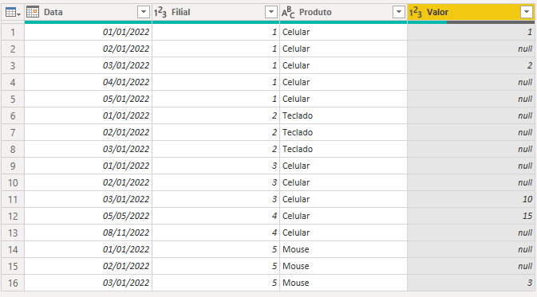
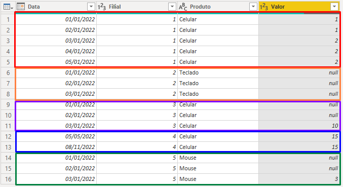

# Código em M para capturar valores de linhas anteriores considerando múltiplas colunas/granularidades

## Função LAG

Em linguagens como SQL, Python, dentre outras, existem diversas funções capazes de manipular dados conforme uma necessidade específica. Dentre elas, uma muito conhecida no universo de análise e engenharia de dados é a função analítica LAG da linguagem SQL. 

Com essa função, torna-se possível acessar a uma linha utilizando determinado deslocamento físico que antecede a linha atual e nestes cenários, ainda sim, torna-se possível respeitar granularidades como tempo, local, etc.

## Problema

O desafio a ser solucionado neste repositório, é a utilização da linguagem Power Query para realizar esse deslocamento físico respeitando as colunas de Produto e Filial. 


<p align="center">
    
</p>

Neste exemplo, o objetivo é capturar o valor da data anterior realizando o deslocamento, atentando-se que a data anterior nem sempre será o dia anterior, mas sim a última data anterior com valor existente. 

## Solução 

Deixo abaixo a solução utilizada em Power Query através da linguagem M, no qual agrupa a tabela por Filial e Produto e ordena os valores através das datas de maneira ascendente. Após isso, é utilizado o recurso de preenchimento para baixo, no qual neste caso preencherá os valores de maneira inteligente respeitando a granularidade determinada.

```
let
    Fonte = Table.FromRows(Json.Document(Binary.Decompress(Binary.FromText("hY+xCoAgEIbfxVnIu1Nob25rCwcpNyEofP8sKYyUg/uH4/s4f+dZKOjSoEIUUkDK4EMMbr83K5OATSFzanLMgmYOGIaXDa9Mfglu3V6ODCeGl/ep8j4ynJoc1PtD8xj6a5hs9B1A3fh3NCnjFg9fbfin1KAkrD0B", BinaryEncoding.Base64), Compression.Deflate)), let _t = ((type nullable text) meta [Serialized.Text = true]) in type table [Data = _t, Filial = _t, Produto = _t, Valor = _t]),
    #"Tipo Alterado" = Table.TransformColumnTypes(Fonte,{{"Data", type date}, {"Filial", Int64.Type}, {"Valor", Int64.Type}}),
    #"Linhas Agrupadas" = Table.Group(#"Tipo Alterado", {"Filial", "Produto"}, {{"TempTable", each _, type table [Data=nullable date, Filial=nullable number, Produto=nullable number, Valor=nullable number]}}),
    #"Personalização Adicionada" = Table.AddColumn(#"Linhas Agrupadas", "FinalTable", each Table.FillDown([TempTable],{"Valor"})),
    #"Personalizar.1 Expandido" = Table.ExpandTableColumn(#"Personalização Adicionada", "FinalTable", {"Data", "Valor"}, {"Data", "Valor"}),
    #"Colunas Removidas" = Table.RemoveColumns(#"Personalizar.1 Expandido",{"TempTable"}),
    #"Colunas Reordenadas" = Table.ReorderColumns(#"Colunas Removidas",{"Data", "Filial", "Produto", "Valor"}),
    #"Tipo Alterado1" = Table.TransformColumnTypes(#"Colunas Reordenadas",{{"Data", type date}, {"Valor", Int64.Type}})
in
    #"Tipo Alterado1"
```

### Resultado final

Abaixo, pode-se observar o resultado final.

<p align="center">
    
</p>
